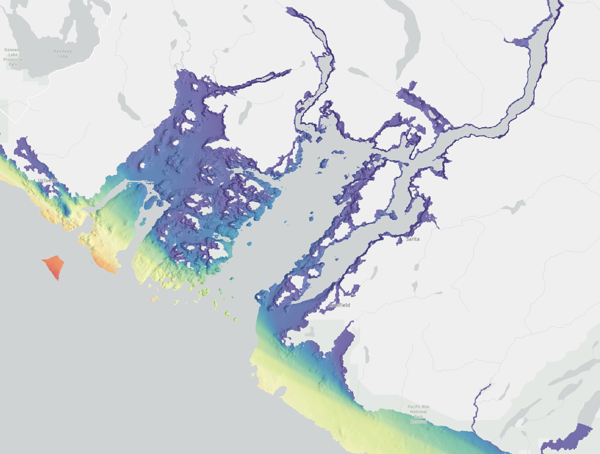
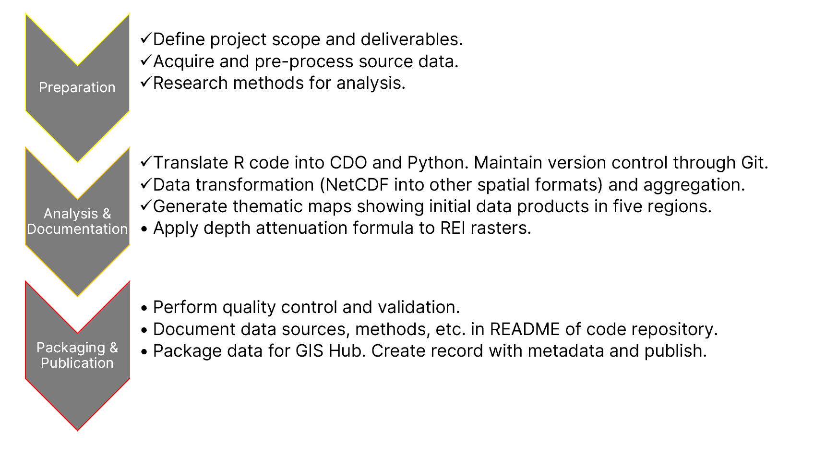
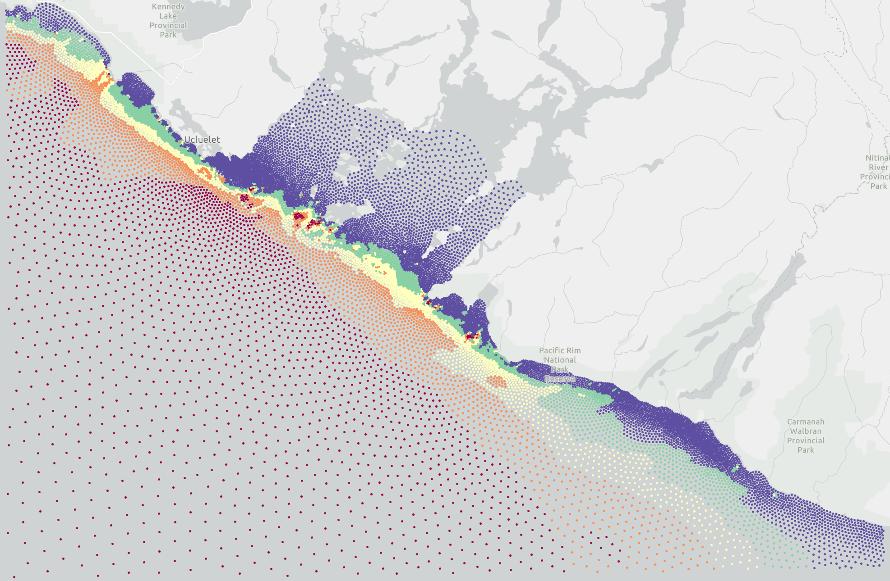

#  Project Status Update: Relative Exposure Index (REI) in Pacific Canada

**Project Repository:** https://github.com/cole-fields/REI-WaveExp/tree/hrdps

**Date:** 2023-09-13

## Table of Contents
- [1. Introduction](#1-introduction)
- [2. Project Overview](#2-project-overview)
- [3. Objectives](#3-objectives)
- [4. Scope](#4-scope)
- [5. Methodology](#5-methodology)
- [6. Data Sources](#6-data-sources)
- [7. Tools and Technologies](#7-tools-and-technologies)
- [8. Progress Update](#8-progress-update)
- [9. Challenges](#9-challenges)
- [10. Next Steps](#10-next-steps)
- [11. Conclusion](#11-conclusion)

## 1. Introduction

This Project Status Update document provides a snapshot of the progress made in the spatial analysis project for the creation of the Relative Exposure Index (REI) layers in Pacific Canada. It includes key project details and highlights the current status of various project components.

## 2. Project Overview

The project's primary goal is to generate five regional spatial layers that provide a relative exposure index (REI) to wind-driven waves along the coastal zone of Pacific Canada. The focus is on generating depth-attenuated Relative Exposure Index layers.

## 3. Objectives

The project's main objectives remain unchanged:

- Translate existing R code: https://github.com/obrienjm25/REI-WaveExp into CDO operations and python scripts.
- Generate and deliver Relative Exposure Index geotiff raster files for five predefined regions for species distribution modelling.
- Implement depth attenuation to account for the diminishing effect of wind-wave energy with greater depth.
- Normalize output rasters on 0-1 scale and align with other predictor variables.
- Package data and metadata and publish on GIS Hub.
- Document code on repository.

## 4. Scope

The project scope encompasses the following key areas:

- Spatial analysis of nearshore (<= 50 m depth and within 5km of coast) environment in Pacific Canada.
- Development and modification of R, Python, and shell scripts for data processing and analysis.
- Utilization of the Climate Data Operators (CDO) software for specific operations.
- Creation of geotiff raster files for the five predefined regions.

## 5. Methodology

The project continues to follow the established methodology, including data collection, preprocessing, spatial analysis, CDO integration, geotiff raster generation, quality control, and documentation.

## 6. Data Sources

Data from various sources, including the High Resolution Deterministic Prediction System (HRDPS) wind data and existing fetch data, have been collected and integrated into the analysis. Bathymetric data will be used to apply a exponential decay or other function.

<iframe src="reference/mx_spd_bin_rose.html" width="600" height="400"></iframe>

<iframe
    width="640"
    height="480"
    src="https://youtu.be/ORtiZIZJf-M"
    frameborder="0"
    allow="autoplay; encrypted-media"
    allowfullscreen
>
</iframe>

## 7. Tools and Technologies

The project relies on the following tools and technologies:

- Geographic Information System (GIS) software for spatial analysis.
- Python and R programming for data processing and analysis.
- Climate Data Operators (CDO) software and shell scripts for specific data operation procedures.
- Geospatial libraries and packages for Python (e.g., ArcPy, GeoPandas, xarray, and rasterio).

## 8. Progress Update

### Key Achievements:
- Translation of R code to CDO operations.
- High Resolution wind data processed for all regions.
- Initial REI layers created.

### Current Status:
- Data collection and preprocessing are complete. Preprocessing includes getting tabular fetch data from spatial files and ensuring consistency in attributes between all regions.
- Translation of R code into CDO software operations in shell scripts is complete.
- Spatial analysis for Relative Exposure Index is in progress. This includes running the shell scripts with CDO operations for each of the five regions.
- Python scripts for depth attenuation analysis are being refined. The remaining component testing and implementing a decay factor for depth attenuation of the REI products.
- Initial geotiff raster files have been generated.

## 9. Challenges

### Current Challenges:
- Wave data: too many uncertainties about creating REI layer derived from modelled wave products. Different data sources, varying resolution, and most importantly an unknown process to calculate the REI. There are also data gaps to consider with modelled wave data. In contrast, using wind data follows an established methodology and a consistent source for all regions.
- Depth attenuation formula: currently looking at exponential decay factor applied to REI.
- Validating results: comparison to UVIC wave data showed greater agreement between original fetch and significant wave height because HSIG was greater further from coast which aligns with fetch sum calculations.

## 10. Next Steps

### Immediate Next Steps:
- Complete spatial analysis and depth attenuation.
- Finalize Python, shell, and R scripts for data processing.
- Update README.md file with all methods and data sources.
- Generate geotiff raster files for all regions and normalize.
- Package and publish on GIS Hub (align rasters, normalize, create metadata record).

## 11. Conclusion

The project is progressing steadily toward its objectives, with key milestones achieved and challenges being addressed. 
